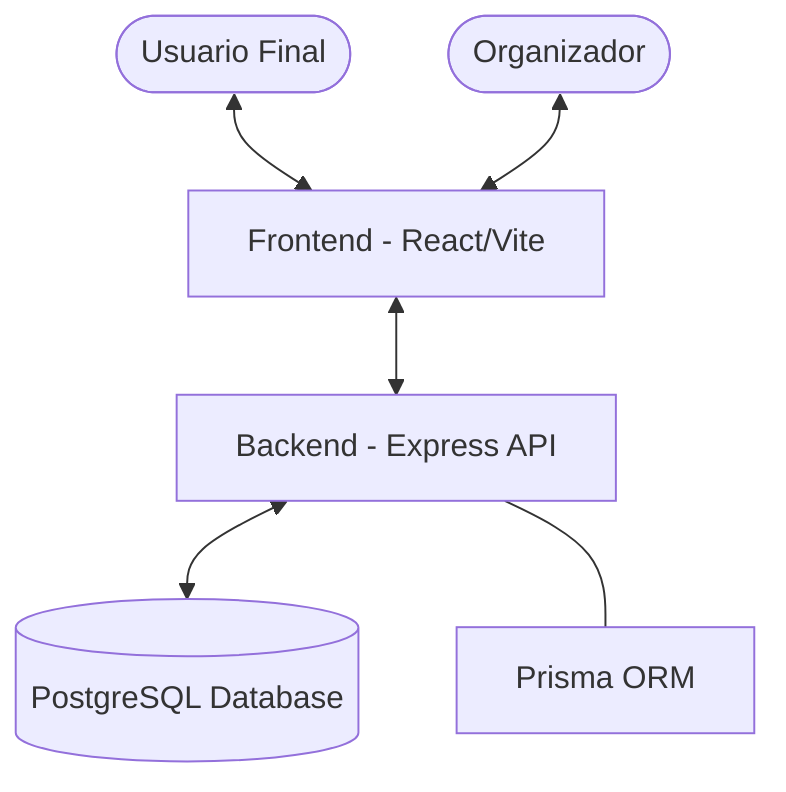

# PartyOn — Plataforma de Venta de Entradas

🎉 **PartyOn** es una solución personalizada y autogestionada para la venta de entradas de eventos (especialmente fiestas latinas). Permite al organizador tener control total sobre la estética de la web, gestionar tipos de entradas y procesar ventas sin comisiones de terceros.

## 🏗️ Arquitectura del Sistema

El proyecto está dividido en tres capas principales corriendo en contenedores Docker:



## ✅ Estado Actual (Hitos Alcanzados)

### 1. **Frontend (Cliente & Backoffice)**
- **Rediseño Premium:** Interfaz inspirada en plataformas como DICE/Resident Advisor con tipografía *Space Grotesk*.
- **Checkout Responsivo:** Optimización de contenedores para asegurar que la pasarela de pagos sea scrollable y funcional en todos los dispositivos móviles (Fix de desbordamiento).
- **Backoffice Dinámico:** Panel administrativo para gestionar textos, colores y fondos en tiempo real.
- **Sincronización Global:** Implementación de **Zustand** para reflejo instantáneo de cambios.
- **Localización Completa:** Plataforma totalmente en **Español**.

### 2. **Pasarela de Pagos (Stripe)**
- **Arquitectura de Singleton:** Centralización del cliente Stripe en el backend para evitar errores de conexión y mejorar el rendimiento.
- **Validación de Datos en Caliente:** Integración de `payment_method_data` para sincronizar los datos del comprador con Stripe Elements de forma segura.
- **Modo de Prueba:** Flujo completo habilitado con advertencias inteligentes sobre la configuración de llaves.

### 3. **Backend (API & Persistencia)**
- **Docker-Compose Inject:** Sincronización automática de secretos entre el host y los contenedores mediante sustitución de variables.
- **Base de Datos Robusta:** PostgreSQL gestionado con Prisma para seguridad transaccional total.

---

## 🛠️ Tecnologías Utilizadas

- **Frontend:** React 19 + Vite + Tailwind CSS v4 + Framer Motion + Zustand.
- **Backend:** Node.js + Express 5 + TypeScript.
- **ORM:** Prisma v5.
- **Infraestructura:** Docker + Docker Compose.
- **Pagos:** Stripe API.

---

## 🚀 Cómo ejecutar el proyecto

1. **Clonar el repositorio.**
2. **Configurar Variables de Entorno:**
   - Crear un archivo `.env` en la **raíz** del proyecto con `STRIPE_SECRET_KEY`.
   - Crear un archivo `.env` en `backend/` con `DATABASE_URL` y `RESEND_API_KEY`.
   - Crear un archivo `.env` en `frontend/` con `VITE_STRIPE_PUBLIC_KEY`.
3. **Levantar los contenedores:**
   ```bash
   docker-compose up -d --build
   ```
4. **Acceder a las aplicaciones:**
   - **Tienda (Cliente):** `http://localhost:5173` (o el puerto asignado por Vite).
   - **Backoffice (Admin):** `http://localhost:5173/admin`.
   - **API Backend:** `http://localhost:3000`.

---

## 🔜 Próximos Pasos (Roadmap)

| Fase | Tarea | Descripción |
| :--- | :--- | :--- |
| **Fase 1: Notificaciones** | 📧 Envío de Emails | Integración con **Resend** para enviar el ticket con código QR tras la compra. |
| **Fase 2: Seguridad** | 🔐 Admin Auth | Añadir login seguro al Backoffice (Middleware de autenticación). |
| **Fase 3: Validación** | 📱 Validador QR | Desarrollo de la página de escaneo para el personal de puerta (validación en tiempo real). |
| **Fase 4: Análisis** | 📊 Dashboard | Gráficos de ventas y métricas de asistencia. |

---

> [!TIP]
> **Nota de Desarrollo:** Para ver los cambios del Backoffice reflejados en la tienda, asegúrate de hacer clic en **"Guardar Cambios"**. La base de datos se actualizará y la tienda sincronizará la nueva configuración automáticamente.
