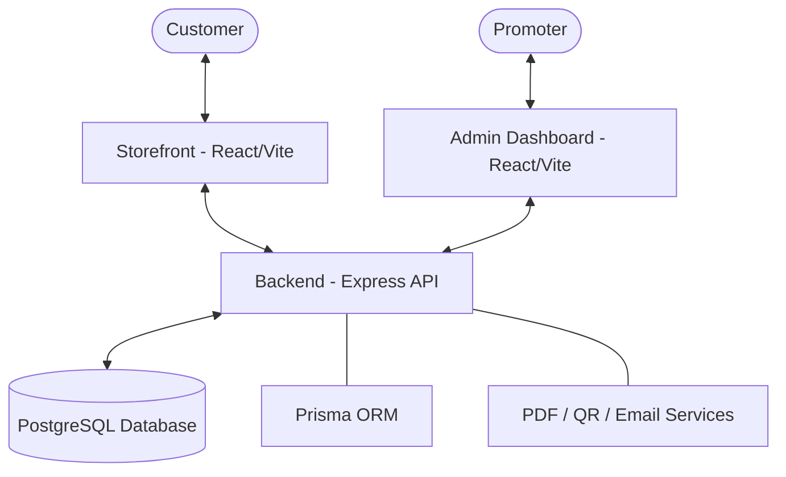

# 🚀 PartyOn — Event ERP & Ticketing Platform

🎉 **PartyOn** is a professional, self-hosted end-to-end solution for event management and ticket sales. Designed for event promoters who demand total aesthetic control and real-time financial intelligence without third-party commissions.

---

## 🏗️ System Architecture

The project is a containerized full-stack application built for maximum reliability and ease of deployment.



---

## ✅ Current Milestones (Operational MVP)

### 1. **Management & Financial Intelligence**
- **Management Dashboard**: Real-time analytics showing **Total Revenue**, **Operational Expenses**, and **Net Profit**.
- **Occupancy Tracking**: Visual progress bars monitoring ticket sales vs. venue capacity.
- **Expense Registry**: Detailed breakdown of costs (Venue, DJ, Security, etc.) for accurate ROI tracking.

### 2. **Admin Backoffice (Configuration)**
- **Aesthetic Engine**: Real-time control over brand colors, typography, and logos.
- **Responsive Backgrounds**: Ability to upload separate background assets for Desktop and Mobile views.
- **Event Lifecycle**: Manage event status (Draft, Active, Completed, Archived) with safety interlocks for live events.
- **Stability**: Implementation of defensive programming in the save handlers to prevent UI crashes and ensure data integrity.

### 3. **Validation & Security**
- **QR Scanner**: Mobile-optimized scanner for door staff to validate tickets in real-time.
- **Audit Logs**: Comprehensive system logs tracking scans, sales, and administrative changes.
- **RBAC Ready**: Authentication middleware integrated to handle Admin and Staff roles.

### 4. **Customer Experience & Checkout**
- **Premium Storefront**: High-end UX inspired by modern ticketing platforms (DICE, RA).
- **Stripe Integration**: Secure 2-step checkout using Stripe Elements and PaymentIntents.
- **Smart Delivery**: Grouped PDF ticket delivery via Resend (one email per order, multiple attachments).
- **Professional PDFs**: "Club-Pass" v3 templates with unique QR codes and event metadata.

---

## 🛠️ Technology Stack

- **Frontend**: React 19 + Vite + Tailwind CSS v4 + Framer Motion + Lucide Icons.
- **Backend**: Node.js + Express + TypeScript.
- **Database**: PostgreSQL + Prisma ORM v5.
- **Services**: 
  - **Stripe**: Payment processing.
  - **Resend**: Transactional email delivery.
  - **React-PDF**: Dynamic PDF generation.
  - **Date-fns-tz**: Strict timezone management (Europe/Lisbon).
- **Infrastructure**: Docker + Docker Compose.

---

## 🚀 Getting Started

1. **Clone the repository.**
2. **Setup Environment**:
   - Create a `.env` file in the root with `STRIPE_SECRET_KEY`, `RESEND_API_KEY`, and `DATABASE_URL`.
3. **Launch Containers**:
   ```bash
   docker-compose up -d --build
   ```
4. **Access Points**:
   - **Storefront**: `http://localhost:5173`
   - **Admin Panel**: `http://localhost:5173/admin`
   - **Database Studio**: `npx prisma studio` (inside /backend)

---

## 🔜 Roadmap & Future Development

We are currently pausing development to focus on a standalone Gamification MVP. All pending technical tasks, including **"Door Sale" logic**, **User Management UI**, and **Advanced RBAC**, are documented in:

👉 **[PROJECT_BACKLOG.md](./PROJECT_BACKLOG.md)**

---

> [!TIP]
> **Timezone Note**: This platform is strictly configured for the **Europe/Lisbon** timezone. Ensure your server time or environment variables are synced to avoid 1-hour shifts in event start/end times.
