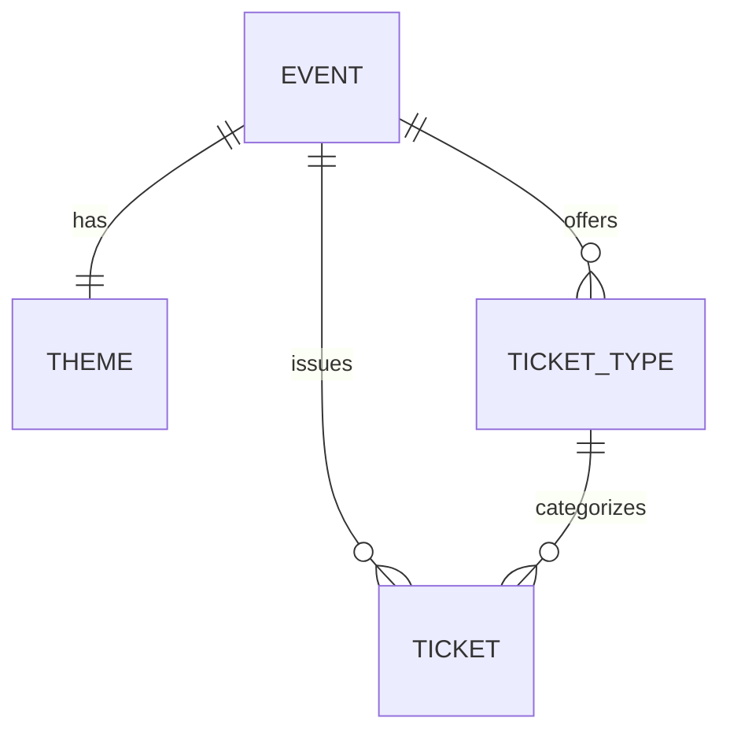

# PartyOn — Plataforma de Venta de Entradas

🎉 **PartyOn** es una solución personalizada y autogestionada para la venta de entradas de eventos (especialmente fiestas latinas). Permite al organizador tener control total sobre la estética de la web, gestionar tipos de entradas y procesar ventas sin comisiones de terceros.

## 🏗️ Arquitectura del Sistema

El proyecto está dividido en tres capas principales corriendo en contenedores Docker:


## ✅ Lo que tenemos (Estado Actual)

### 1. **Frontend (Cliente & Backoffice)**
- **Rediseño Premium:** Interfaz inspirada en plataformas como DICE/Resident Advisor con tipografía *Space Grotesk*.
- **Backoffice Dinámico:** Panel administrativo para cambiar:
    - Textos del logo, nombre de la fiesta, tagline y lineup.
    - Colores de acento y fondos de pantalla.
    - Sincronización en tiempo real con la base de datos.
- **Flujo de Compra:** Selección de entradas con diseño de "ticket físico" y formulario de checkout.

### 2. **Backend (API & Lógica)**
- **Base de Datos Robusta:** PostgreSQL gestionado con Prisma para escalabilidad.
- **Modelos Implementados:** `Event`, `Theme`, `TicketType` y `Ticket`.
- **Checkout Transaccional:** El sistema reduce el stock de entradas de forma segura en la base de datos cuando se realiza una compra.
- **Dockerizado:** Entorno estable usando imágenes `node:20-slim` para compatibilidad con OpenSSL.

### 3. **Base de Datos (Esquema)**


---

## 🛠️ Tecnologías Utilizadas

- **Frontend:** React + Vite + Tailwind CSS v4 + Framer Motion.
- **Backend:** Node.js + Express + TypeScript.
- **ORM:** Prisma v5.
- **Infraestructura:** Docker + Docker Compose.
- **Base de Datos:** PostgreSQL.

---

## 🚀 Cómo ejecutar el proyecto

1. **Clonar el repositorio.**
2. **Levantar los contenedores:**
   ```bash
   docker-compose up -d --build
   ```
3. **Acceder a las aplicaciones:**
   - **Tienda (Cliente):** `http://localhost:5174` (o el puerto que asigne Vite).
   - **Backoffice (Admin):** `http://localhost:5174/admin`.
   - **API Backend:** `http://localhost:3000`.

---

## 🔜 Próximos Pasos (Roadmap)

| Fase | Tarea | Descripción |
| :--- | :--- | :--- |
| **Fase 1: Pagos** | 💳 Integración con Stripe | Conectar el checkout con la pasarela de pagos real. |
| **Fase 2: Notificaciones** | 📧 Envío de Emails | Generación de tickets con código QR y envío automático vía Resend/Nodemailer. |
| **Fase 3: Seguridad** | 🔐 Admin Auth | Añadir login seguro al Backoffice para que solo el organizador pueda editar. |
| **Fase 4: Validación** | 📱 Validador QR | Crear una página oculta para el personal de puerta que escanee y valide tickets en tiempo real. |
| **Fase 5: Métricas** | 📊 Dashboard | Gráficos de ventas y asistencia en el Backoffice. |

---

> [!TIP]
> **Nota de Desarrollo:** Para ver los cambios del Backoffice reflejados en la tienda, asegúrate de hacer clic en **"Guardar Cambios"**. La base de datos se actualizará y la tienda mostrará la nueva configuración al recargar.
